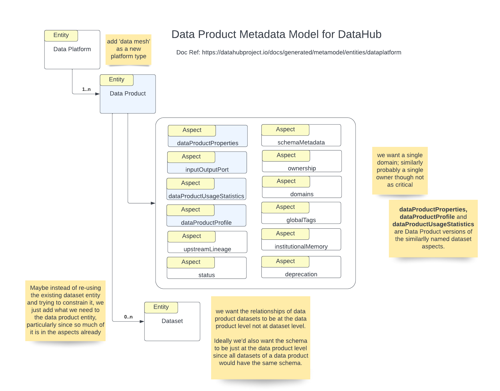

- Start Date: 2023-01-24
- RFC PR: [https://github.com/datahub-project/rfcs/pull/1](https://github.com/datahub-project/rfcs/pull/1)
- Discussion Issue: [Discussion on Slack](https://datahubspace.slack.com/archives/C03UV8BNXEW/p1673471786747339)
- Implementation PR(s): (leave this empty)

# Data Products Model

## Summary

There has been a lot of interest in the community over the past 6 months in creating a Data Product entity in the DataHub metadata model.
This is understandable, as a lot of Data Mesh implementations [1](https://optum.github.io/blog/2022/03/23/data-mesh-via-datahub/), [2](https://blog.datahubproject.io/enabling-data-discovery-in-a-data-mesh-the-saxo-journey-451b06969c8f) etc. are leveraging DataHub as the Data Discovery and Metadata solution.
This RFC attempts to first document all the ideas that have been proposed with attribution, before starting a discussion around convergence on a common model.

## Motivation

See Summary section.

## Suggested Principles for the Model
- Start with the slimmest model possible that accomplishes the MVP requirements. This will ensure that we broaden the model as we encounter new requirements versus over-designing it too early.

## MVP Requirements
*Suggestions*
- Model Data Product Entity
- Model Ouptput Port Aspect or Entity
- 
TBD

## Emerging Consensus (Still up for debate)

- Data Products are 1:N with DataHub's notion of Datasets and Datasets in Data Products can be N:N with other data products for both input and output.
- Data Products are 1:N with input ports and output ports, there must be at least one output port for a Data Product.
- Output ports expose one or more of the data products' data sets and are distinguished by schema + transport. 
  - **Schema**: You can have multiple Kafka output ports each exposing a different schema (e.g., one with PII and another without PII). 
  - **Transport**: You can expose multiple logical datasets where each logical dataset can have physical variants stored in different platforms and expose a slightly different technical schema (e.g Logical Dataset that can be consumed over Kafka or Athena).
- Data Products can have a logical schema if they are encapsulating a single Logical Dataset with a common schema across the physical dataset variants, but in cases where an entire star schema is being represented as a Data Product, it might just be a collection of related datasets.

## Raw Discussion Log
**0th Thread**
Eric Yomi
@Ray Suliteanu
Thank you for sharing your thoughts on introducing a Data Product entity to datahub. I am new to this community and I read with great interest what you posted. I think the way you proposed to go about adding this feature makes sense to me and is inline with our expectations out in the fields. I am currently working on building Data Mesh platforms for our clients and what you described matches what we looking for. I would however make a couple of suggestions:
- A data product has to have a least one dataset on its output ports. One of the key characteristics of a data product is that it has to be "Valuable on its own". A DP that produces nothing cannot be that.
- I would definitely have dataProductProperties, dataProductUsageStatistics, and dataProductProfile for data products

Ray Suliteanu
Thanks Eric. Yes I agree that a data product must have an output port otherwise it is useless - it is an invalid configuration for a data product with no output port and that should be rejected by the platform. I hope I did not imply otherwise. At this point in time though, our progress is stalled due to various reasons so I expect others may end up getting “data product” into DataHub before we do, which is fine by me!

**First Thread**
Ray Suliteanu
I will share details when we have them, but at a high level here is what we’ve been thinking/considering

- add ‘data mesh’ as a new data platform type, to organize new data product entities; it seemed better than having the existing  container entity to organize them
- a new DataProduct entity
- a new inputOutputPort aspect
- new data product versions of the dataset aspects datasetProperties, datasetUsageStatistics, datasetProfile; alternatively maybe make those not tied to dataset.
- schemaMetadata on the data product entity; this is where things get a little interesting, since in my view the data product has a schema, and all datasets associated with the data product have the same schema, so how to address the fact that dataset currently has a schema as well?
a somewhat similar issue has to do with lineage since I believe the lineage is between data products, not datasets. 

So the general question is how to limit/constrain datasets that are part of the data product, without duplicating what’s there. I was originally thinking to have the new data product entity reference 0..n dataset entities. But maybe it would be better to not try and shoehorn the existing dataset entity and instead just have what the data product entity needs. Curious what peoples’ thoughts are on this, particularly given I’m very new to DH and not familiar with standards, guidelines, best practices
I would also like to have domains be singular for a data product i.e. a data product only belongs to one domain, and similarly ideally I was thinking that owners would be singular for a data product, though on that point I’m less concerned

Deepu Puthrote
Hi Ray thanks for this. Data Product -> 0..n Data sets is what we were thinking as well. It makes sense.
I have a concern about Schema being at the DataProduct level. How is that defined? Do we have to re-define schema at Data Product level? My concern is that this could go out of sync with the associated datasets.
For example a Customer Data Product published to a kafka-topic and ingested to a Apach Hudi table in datalake. In this scenario both datasets, one in kafka-topic and other in Hudi table will have the common schema attributes/fields of the Customer. But the dataset itself may have some extra fields for operational purposes, depending on the how and where it is. Apache Hudi dataset will have extra columns for example, so schema will be slightly different for Hudi dataset and the Kafka Topic.
It could be that the Schema at Data Product level will be common attributes/fields between the related datasets.
Kafka Schema --> ( Data Product Schema ) <-- Hudi Table Schema
Since the Schema is available at DataSet level, can we extract the common fields and display it at Data Product level, instead of having to define it again?

Ray
Thanks Deepu for the feedback. If I understand your example, the Customer Data Product is producing only to the Kafka topic. At that point, it’s responsibility ends. What any consumer does at that point is up to the consumer, whether another data product or a consumer outside the data mesh. If the consumer stores data in a Hudi table and modifies the schema to add some attributes specific to the Hudi-based use case, then that’s a new schema and has nothing to do with the original Consumer Data Product. If the consumer that’s using Hudi is in the mesh, then it’s another data product with its own schema.
But also keep in mind the difference between “data on the inside” and “data on the outside”. A data product is a black box as far as other producers and consumers are concerned. The data products stored in a discovery service and publishing a schema define the public “data on the outside” only. No one cares about the format of the “data on the inside”. So in your example, it could be that the consumption into Hudi table(s) with additional fields is only internal and the public schema is still the exact same customer schema that the Customer Data Product published.
That’s how I see it anyway, and why I have only one schema per data product. Note this is a logical schema and not a physical schema i.e. a data product could support returning a Protobuf IDL file or a GraphQL schema or whatever, for use by consumers of the data product, but they’re just different physical representations of the same schema.

Pedro Figueiredo
in my view the data product has a schema, and all datasets associated with the data product have the same schema
In my mind a data product could serve multiple datasets, e.g. where a data product is represented by a star schema, there will be several different datasets.
The next level down is a logical dataset, which represents a polyglot dataset (e.g. served both in Kafka and Athena, for example) where the schema is the same, you have two physical datasets (both IRL and in DataHub), but the logical dataset as an umbrella.
Since all the underlying schemata can be ingested from the datasets’ definitions, I would prefer not to have to declare it at the data product or logical dataset levels.

Ray Suliteanu
Hi Pedro, thanks, I see your point. One question or point that needs definition is what does “dataset” mean. Perhaps I’m being too narrow. The only thing I see as a dataset is a physical data file or files with a finite number of records. My reasoning being that anything else is not finite. I do not see a database table as a data set because the set may change. Certainly a Kafka topic (or other streaming system) does not represent a “set”.
That said, perhaps the question here is not so much about schemas vis a vis datasets, but whether a Data Product even has any datasets at all. To me, a Data Product has 1..n input ports and 1..n output ports. Everything exposed by the output ports shares the same (logical) schema and the only difference between output ports is the syntax of the schema specific to the type of output port. Datasets don’t even need to come into the picture. Maybe that simplifies the discussion? Or maybe blows it up? :slightly_smiling_face:

Pedro Figueiredo
a dataset is a physical data file or files with a finite number of records
This is intriguing, would love to talk more about it :slightly_smiling_face: As it is today, a dataset in DataHub can certainly be a database table or a Kafka topic. Datasets change - e.g. you serve a website activity summary with some periodicity, is it your view that there is a new dataset every period?

Pedro Figueiredo
To me a dataset can be an evolving collection of data, as long as records are immutable and you can navigate it temporally or otherwise it doesn’t really make a difference if it has stopped growing, or am I missing something?

Eric Yomi
https://github.com/ericyomi/datahub/tree/data-product-entity

**Second Thread**
Ray Suliteanu
@Stefan Driessen thanks for the detailed input and feedback. Very helpful and interesting. At this stage of data mesh, all ideas are good ideas I think. I wanted to share a diagram I put together a few months back to describe to folks in my company a logical view of a data product. fwiw …
 
Stefan Driessen
Yeah, that's nice! So when we relate this to metadata and data catalogs/platforms like datahub, do you envision we should focus on describing the input ports and output ports? Are the input ports fundamentally different from the output ports or can we consider them to be output ports of other data products? I imagine control interfaces exist mostly for the data provider/data product developer and maybe some federated governance team and don't require a lot of metadata?
 
Ray Suliteanu
My view is that a “Data Product” is a tier 1 entity; people discover “data products” not ports; ports are aspects of data products, and are searchable, but the result is a list of data products that match … “find me any data product with Kafka output ports with ‘account’ data”

Ray Suliteanu
I also kind of look at data products vs data sets as the difference between a ‘class’ and a ‘struct’, the former having behavior and encapsulation while the latter just (public) data

Ray Suliteanu
also I’m using the terminology from Zhamak Dehghani and here Data Mesh book when I’m talking about input/output/control ports. The Control Port logical concept is that a data product exposes standard API(s) to e.g. control policies and compliance; one might be an API to implement a ‘delete’ operation in support of ‘right to be forgotten’ - if an end user of a business asks for their data to be deleted the business can propagate the request to the data mesh which broadcasts this to all data products via the control port API that they all implement

Stefan Driessen
*"My view is that a “Data Product” is a tier 1 entity; people discover “data products” not ports; ports are aspects of data products, and are searchable, but the result is a list of data products that match … “find me any data product with Kafka output ports with ‘account’ data”"*

I agree with this sentiment, people discover data products not ports. However, metadata and data catalogs are not just about Discovery, it helps with all aspects of DAUTNIVS, and in particular Addressability and Understandability. If I find a data product entity in my datahub data catalog, I also want to understand how to get to the data (i.e., which output ports are there, which one is relevant for me, and how do I address those). So I reckon we also need to describe these (even if they are not tier 1 entities).

Stefan Driessen
I'm personally less interested in describing the control ports initially as I feel these don't need to live on a data catalog. Am interested to hear if you agree.

**Third Thread**
Ray Suliteanu
by multimodal I mean different transports e.g. files, streams, HTTP, etc. and potentially different wire formats e.g. Kafka port w/Protobuf vs a HTTP port w/JSON

Stefan Driessen
So do you envision a single output port for each transport? Or are the output ports themselves multimodal?

Ray Suliteanu
Output ports are distinguished by schema+transport so you can have multiple Kafka output ports say, each exposing a different schema e.g. as you were suggesting one could have a port that exposes PII data and another without PII data, which are different schemas

Shirshanka Das
Great discussions so far, and apologies for jumping in a bit late. Question on the "schema" aspect of Data Products and Output Ports in your minds. Does the data product have a schema? Since the output ports have an attached schema that more accurately describes the structure of the API for technical consumption, I'm curious what your thoughts are on the need and consumption model (human versus machines) for the data product schema if that exists.

Stefan Driessen
For me, data products don't need to have a schema. Especially if the different output ports have different schemas, it makes more sense to explain how these schemas relate to each other. I suppose if we had a data product with different output ports that fell under a single schema, we could describe the schema on the data product level but then I wonder what the benefit would be for doing that if we also provide schemas at the output port levels.

As for human vs machine consumption, I think data products are almost always created for easy human consumption. If we think about DAUTNIVS (Discoverable, Accessible, Understandable Truthful, Natively accessible, Interoperable, Valuable, Secure) I find it hard to imagine machines that are capable of truly discovering and understanding data products (unless we're talking advanced AI's).

Ray Suliteanu
My original “grand vision” was that a data product did have a single semantic (logical) schema and the output ports simply provided a specific syntactical (physical) schema. Then based on RBAC a consumer would either get or not get sensitive data - it would be automatically filtered by the platform transparently to both data product and data product consumer. I also think that data products are actual physical implementations - a microservice for data conforming to a schema, served up for consumption in whatever formats that the data product owner wants to provide to its customers. That said, there is also of course a human aspect e.g. discovery doesn’t need to be automated - a human finds what data products are available and decides to use them, building a new data product and configuring it with the unique identifier of each data product it’s going to use (if building a data product was the point of discovery).

Of course this all evolves for me the more I learn and think on it :slightly_smiling_face:

Shirshanka Das
Making schemas optional but possible seems to support both ideas. A data product that is simply a wrapper around one or more “schema-aligned” data assets versus a data product that is a container of “use-case aligned” data assets.

Stefan Driessen
It seems to me that that's the right way to approach the metadata aspect of data products versus ports. Make it easy to describe those aspects that are the same across all ports (could even be income ports, outcome ports, control ports, discovery ports) but also allow the data provider to specify what is different across the ports.

### Extensibility

- TBD

## Non-Requirements

- TBD 

## Detailed design

TBD

## How we teach this

TBD

## Drawbacks

TBD

## Alternatives

TBD

## Rollout / Adoption Strategy

TBD

## Future Work

TBD

## Unresolved questions
